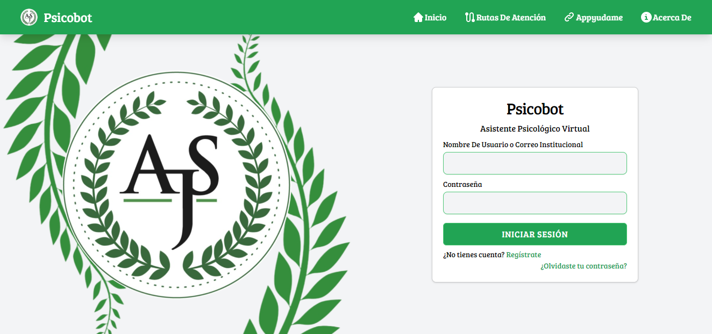
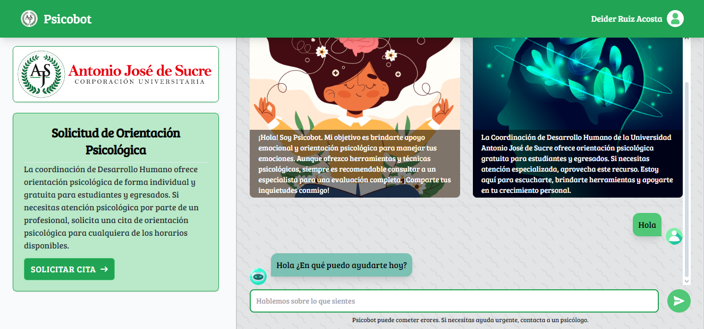
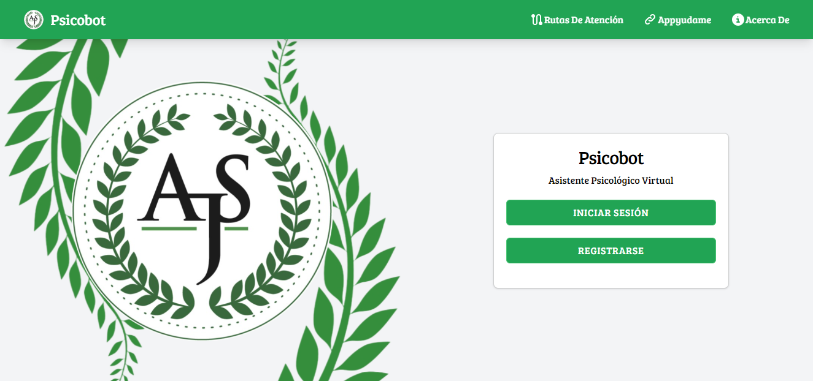
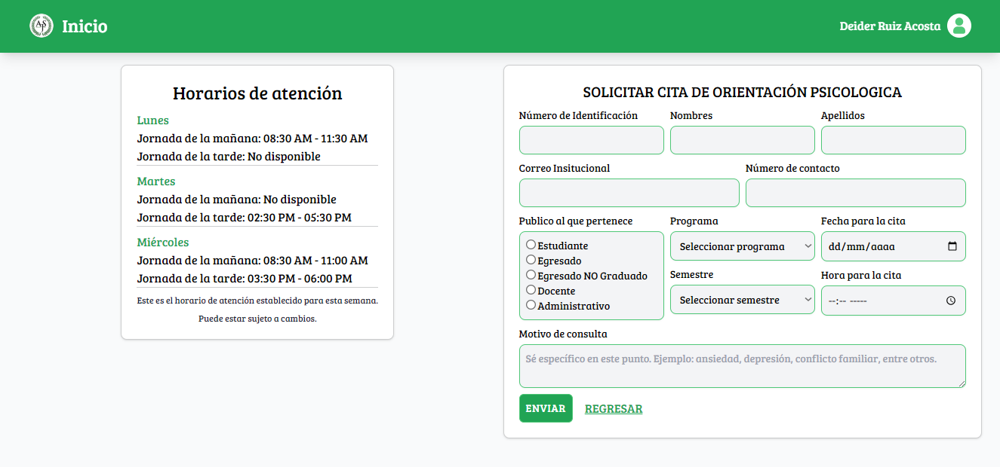
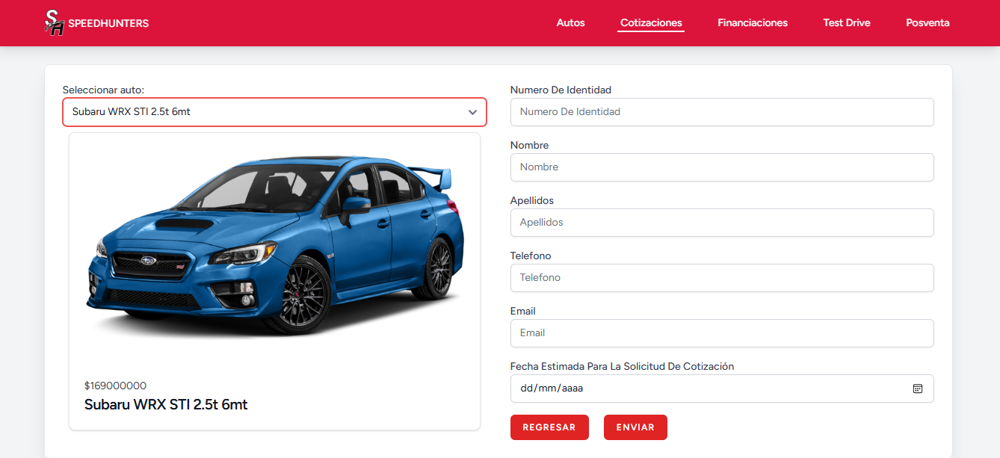
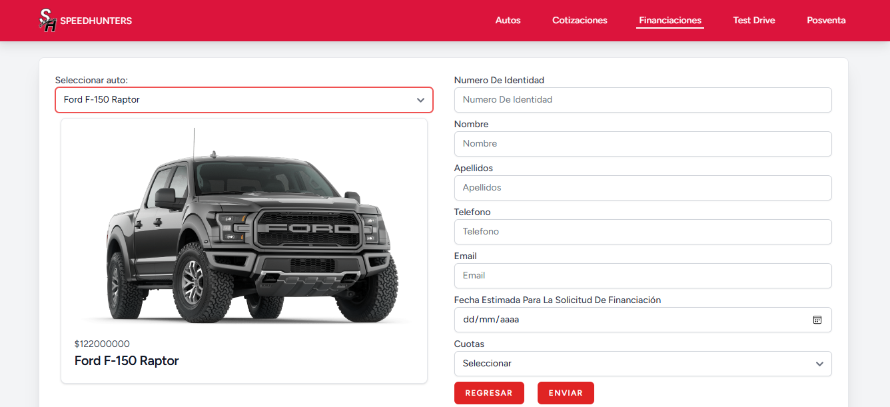
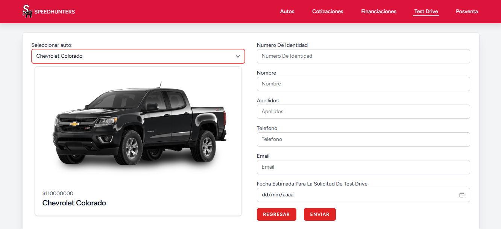
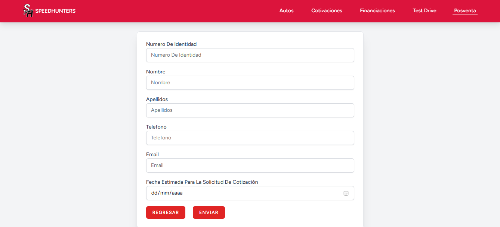
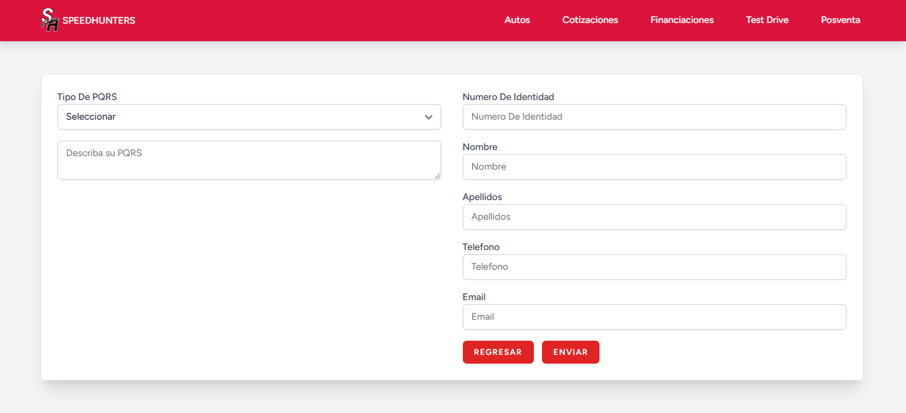

# Sobre mi

Desarrollador Full Stack con experiencia construyendo aplicaciones web completas. Realizo análisis de requisitos, diseño UI/UX, desarrollo de frontend y backend, gestión de bases de datos, pruebas de carga, pruebas de seguridad y despliegue en la nube.

He trabajado en proyectos como:

- 🏨 Una plataforma de gestión hotelera y reserva de habitaciones.  
- 🤖 Un chatbot con inteligencia artificial para apoyar la gestión emocional de estudiantes universitarios.  
- 🚗 Una plataforma de venta de vehículos en línea desarrollada en un entorno académico.

Tecnologías que manejo:  
**Laravel**, **Vue.js**, **Angular**, **Flask**, **PHP**, **Python**, **JavaScript**, **MySQL**, **AWS**, **Tailwind CSS**, **Bootstrap**, **Figma**, **OWASP ZAP** y **Apache JMeter**.

Me enfoco en construir soluciones escalables, seguras y centradas en el usuario.

# Proyectos

## Psicobot – Chatbot con inteligencia artificial para apoyo emocional
Desarrollo de una aplicación web con inteligencia artificial para la gestión emocional en estudiantes universitarios.

### 📌 Funcionalidades y logros destacados:
- 🔧 Desarrollé **dos interfaces responsivas** con Vue.js y Tailwind CSS, evaluadas por usuarios con una calificación promedio de **4.6/5 en usabilidad** (escala Likert).
- 🧩 Construí **APIs RESTful en Flask** para automatizar tres procesos administrativos del servicio de orientación psicológica.
- 🤖 Integré un **chatbot de apoyo psicológico** utilizando la API de OpenAI, complementando la atención del departamento de bienestar universitario.
- 🛡️ Ejecuté **pruebas de seguridad con OWASP ZAP**, identificando y corrigiendo **11 vulnerabilidades críticas**.
- ☁️ Orquesté el **despliegue en AWS** (EC2 y RDS), y validé su rendimiento con pruebas de carga usando Apache JMeter, garantizando estabilidad con más de **500 usuarios simultáneos**.
- 💬 El diseño del flujo conversacional del chatbot obtuvo una confiabilidad psicométrica **(α = 0.87)** en impresión diagnóstica, validada con encuestas a usuarios.

### 🛠️ Tecnologías utilizadas:
`Vue.js` • `Tailwind CSS` • `Flask` • `Python` • `OpenAI API` • `MySQL` • `AWS EC2 / RDS` • `OWASP ZAP` • `Apache JMeter`

  
  

## Psicobot

Página de inicio de Psicobot.

Página de inicio de sesión de Psicobot.

Página de panel de ususario de Psicobot.

Página de formulario de solictud de citas de orientación psicológica de Psicobot.

##

### Desarrollo de una Página Web de Venta de Vehículos en Línea Universidad Antonio José de Sucre
### MIT, Universidad Antonio José de Sucre | Septiembre 2023 - Septiembre 2024

Lideré y participé en el desarrollo de una aplicación web para la venta de vehículos en línea para la automatización de funciones de un concesionario, tales como solicitudes de cotización, financiación, test drive y un servicio posventa de mantenimiento, esto fue realizado cómo parte de proyectos de aula.

Definí requisitos funcionales y no funcionales, con stakeholders para identificar y definir las necesidades técnicas del proyecto. Diseñé mockups en Figma. Desarrollé la aplicación utilizando MySQL para la base de datos, JavaScript y Bootstrap para el frontend, y PHP para el backend. Posteriormente, realicé la migración a Laravel, mejorando la estética y funcionalidad de la aplicación con Tailwind CSS.

## SPEEDHUNTERS

Página de inicio de SPEEDHUNTERS.

Formulario de solicitud de cotización de autos de SPEEDHUNTERS.

Formulario de solicitud de Financiación de autos de SPEEDHUNTERS.

Formulario de solicitud de Test Drive de autos de SPEEDHUNTERS.

Formulario de solicitud de posventa de SPEEDHUNTERS.

Formulario de PQRS de SPEEDHUNTERS.

## 🔗 Links

