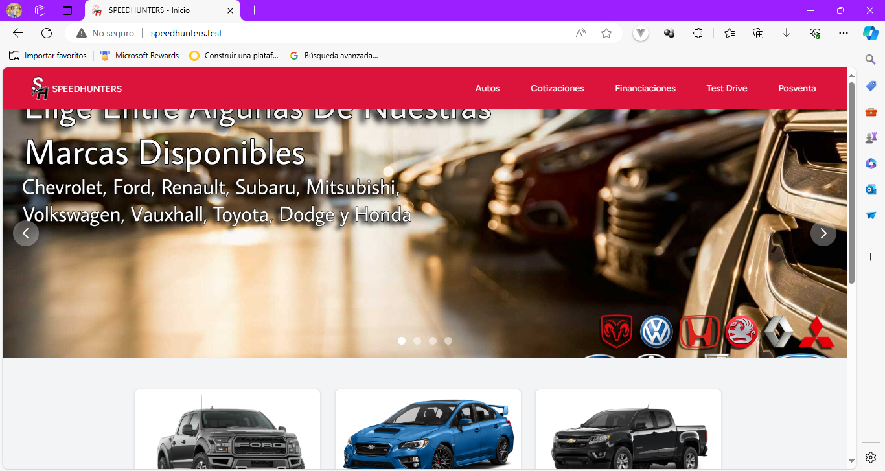
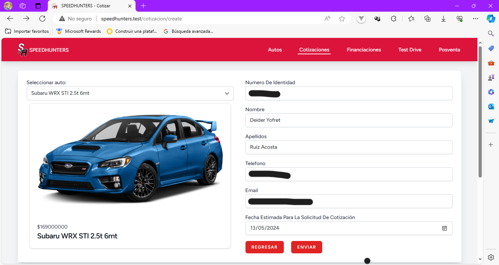
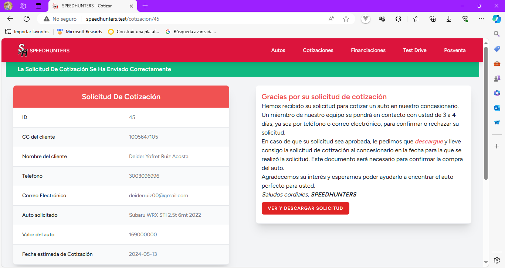
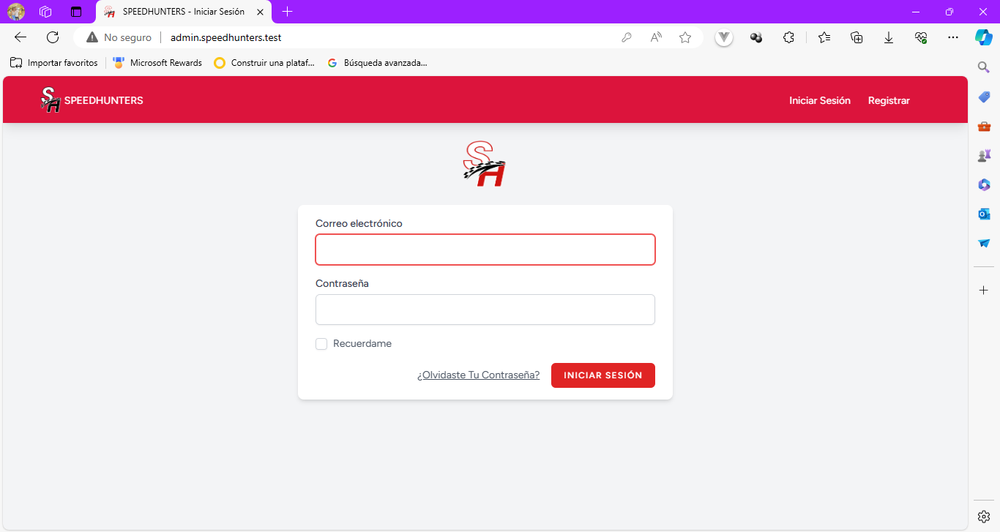

## 🚀 Sobre Mí
Soy Deider Yofret Ruiz Acosta, estudiante de Ingeniería de Sistemas. Aunque no tengo experiencia laboral formal, he liderado un proyecto web, en donde desarrollé una aplicación web de un concesionari de autos en linea llamado SPEEDHUNTERS. Estoy buscando constantemente oportunidades para expandir mis habilidades técnicas. Soy un líder natural con una fuerte ética de trabajo y una rápida capacidad de aprendizaje. Mi objetivo es contribuir consoluciones innovadoras en el campo de la tecnología.

## 🛠 Habilidades
Tengo habilidades en los siguientes lenguajes de programación y tecnologías:
- HTML y CSS: 3 años de experiencia
- PHP: 2 años de experiencia
- JavaScript: 2 años de experiencia
- Laravel: 2 años de experiencia
- MySQL: 2 años de experiencia
- Angular: 1 año de experiencia
- Figma: 1 año de experiencia
- Vue.js: Menos de 1 año de experiencia

## Proyectos

### Desarrollo de una Aplicación Web para la Venta de Vehículos En Línea

Como parte de un proyecto de investigación universitario, lideré el desarrollo de una aplicación web para un concesionario de autos (SPEEDHUNTERS). Mi equipo y yo presentamos este proyecto en un evento competitivo de la Corporación Universitaria Antonio José De Sucre. Como el miembro del equipo con más experiencia en programación, me encargué de la mayoría del trabajo.

Durante la fase de análisis de requisitos, trabajé en estrecha colaboración con nuestro profesor para definir los requisitos de la aplicación. En la fase de diseño, utilicé MySQL Workbench para crear el modelo de la base de datos y Figma para desarrollar un prototipo no funcional de la interfaz de usuario.
#### Tecnologías usadas

**Cliente:** HTML, CSS, PHP, Laravel, Tailwind CSS

**Servidor:** PHP, MySQL, phpMyAdmin

En la fase de desarrollo, manejé todo lo relacionado con la base de datos, que creé en phpMyAdmin. Utilicé PHP para el back-end y HTML y CSS para el front-end. En una versión mejorada de la aplicación, implementé Laravel para el back-end y cambiamos a Tailwind CSS para el front-end. A pesar de las mejoras, la aplicación se mantuvo como una MPA y se trabajó de forma local debido a limitaciones de presupuesto. A lo largo de este proyecto, adquirí una valiosa experiencia en el desarrollo de aplicaciones web y en el trabajo en equipo.

## SPEEDHUNTERS

Página de inicio de SPEEDHUNTERS.

Formulario de solicitud de cotización de autos de SPEEDHUNTERS (Los formularios de los demás servicios son similares).

Vista de la cotización ya solicitada en SPEEDHUNTERS.

Login de administrador de SPEEDHUNTERS (en un subdominio)

## 🔗 Links

