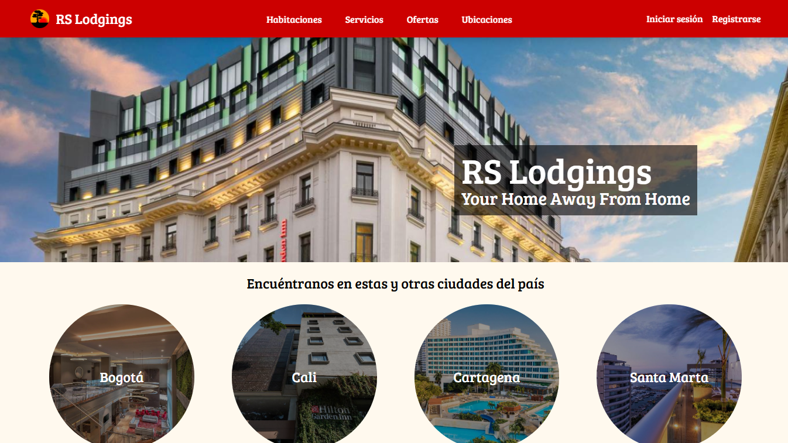
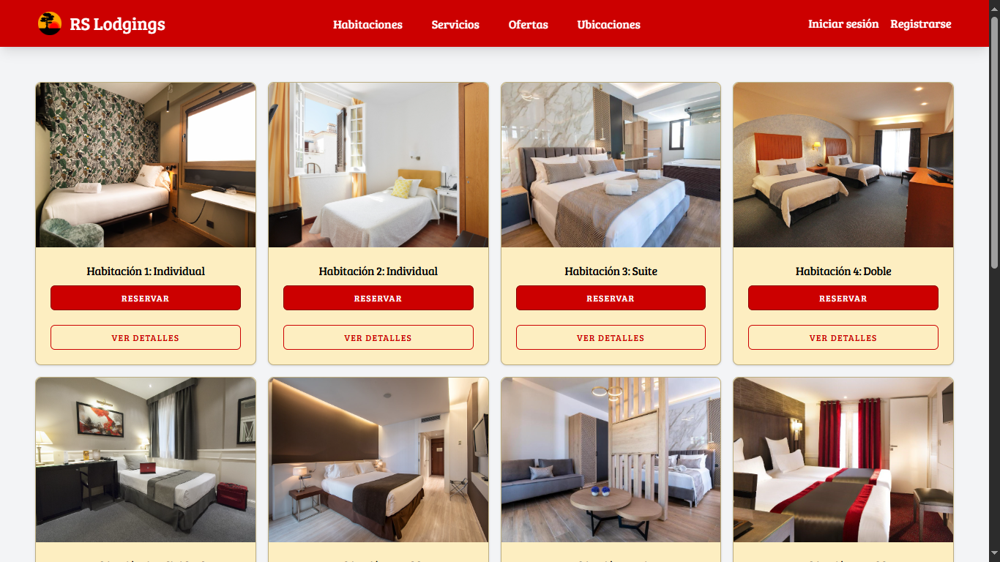
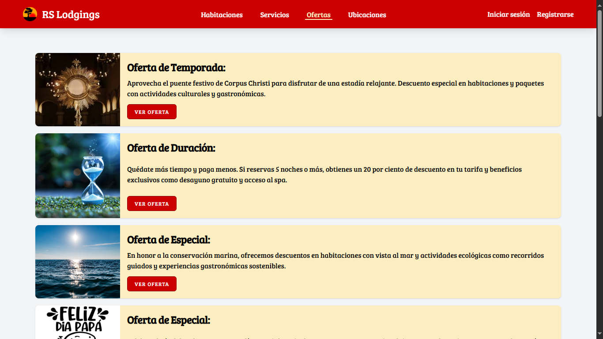
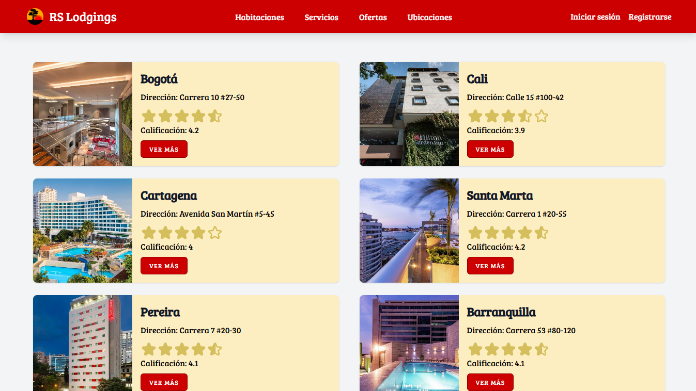

# 👨‍💻 Sobre mi

Desarrollador Full Stack con experiencia construyendo aplicaciones web completas. Realizo análisis de requisitos, diseño UI/UX, desarrollo de frontend y backend, gestión de bases de datos, pruebas de carga, pruebas de seguridad y despliegue en la nube.

He trabajado en proyectos como:

- 🏨 Una plataforma de gestión hotelera y reserva de habitaciones.  
- 🤖 Un chatbot con inteligencia artificial para apoyar la gestión emocional de estudiantes universitarios.  
- 🚗 Una plataforma de venta de vehículos en línea desarrollada en un entorno académico.

Tecnologías que manejo:  
**Laravel**, **Vue.js**, **Angular**, **Flask**, **PHP**, **Python**, **JavaScript**, **MySQL**, **AWS**, **Tailwind CSS**, **Bootstrap**, **Figma**, **OWASP ZAP** y **Apache JMeter**.

Me enfoco en construir soluciones escalables, seguras y centradas en el usuario.

# 🌐 Redes y contacto

# 🚀 Proyectos

## RS Logings – Plataforma web para reserva y gestión hotelera
Desarrollé un prototipo de software para la gestión hotelera como parte de mi proceso de mejora en el desarrollo web, para reforzar mis habilidades como Full Stack developer ante la falta de oportunidades reales para mostrar mis capacidades. Así desarrollé RS Lodgings, una aplicación web inspirada en el modelo de la cadena de hoteles Hilton Garden Inn, enfocada en la reserva de habitaciones de hoteles y administración de habitaciones, servicios, ofertas y reservas de negocios hoteleros pequeños.
Definí los requisitos funcionales y no funcionales, diseñé una interfaz grafica intuitiva con Figma, Estructuré la base de datos MySQL, desarrollé el backend con Laravel y el frontend con Vue.js y Tailwind CSS, asegurando un prototipo funcional y completo.
Este proyecto me permitió, en una de las pocas entrevistas donde revisaron a fondo mi portafolio, mostrar lo que puedo construir de forma autónoma, además consolidé mis conocimientos de Laravel, aprendí a integrar métodos de pago mediante SDK y automatizar tareas mediante Cron Jobs.

### 📌 Funcionalidades y logros destacados:
- 🖥️ Desarrollé **tres interfaces interactivas** utilizando Laravel Inertia, Vue.js y Tailwind CSS, mejorando la fluidez e intuitividad de la experiencia de usuario.
- 🧩 Estructuré y optimicé **componentes reutilizables**, facilitando la escalabilidad y el mantenimiento del código frontend.
- 🔄 Automatizé **7 procesos administrativos** con APIs RESTful, agilizando la operación diaria y reduciendo errores humanos.
- ⚡ Optimizé consultas SQL en **MySQL**, logrando una mejora del **36% en los tiempos de carga** de la aplicación.
- 💳 Integré y configuré el **SDK de PayPal** para automatizar cobros en línea, reforzando la seguridad de las transacciones.
- ⏱️ Diseñé y desplegué un **Cron Job diario** para actualizar automáticamente el estado de reservas y disponibilidad, eliminando en un **99.9% la intervención manual**.

### 🛠️ Tecnologías utilizadas:
`Laravel` • `Vue.js` • `Tailwind CSS` • `MySQL` • `PayPal SDK` • `Inertia.js`

  
  

  
  

### 🔗 Enlace al repositorio

## Psicobot – Chatbot con inteligencia artificial para apoyo emocional
Desarrollo de una aplicación web con inteligencia artificial para la gestión emocional en estudiantes universitarios.

### 📌 Funcionalidades y logros destacados:
- 🔧 Desarrollé **dos interfaces responsivas** con Vue.js y Tailwind CSS, evaluadas por usuarios con una calificación promedio de **4.6/5 en usabilidad** (escala Likert).
- 🧩 Construí **APIs RESTful en Flask** para automatizar tres procesos administrativos del servicio de orientación psicológica.
- 🤖 Integré un **chatbot de apoyo psicológico** utilizando la API de OpenAI, complementando la atención del departamento de bienestar universitario.
- 🛡️ Ejecuté **pruebas de seguridad con OWASP ZAP**, identificando y corrigiendo **11 vulnerabilidades críticas**.
- ☁️ Orquesté el **despliegue en AWS** (EC2 y RDS), y validé su rendimiento con pruebas de carga usando Apache JMeter, garantizando estabilidad con más de **500 usuarios simultáneos**.
- 💬 El diseño del flujo conversacional del chatbot obtuvo una confiabilidad psicométrica **(α = 0.87)** en impresión diagnóstica, validada con encuestas a usuarios.

### 🛠️ Tecnologías utilizadas:
`Vue.js` • `Tailwind CSS` • `Flask` • `Python` • `OpenAI API` • `MySQL` • `AWS EC2 / RDS` • `OWASP ZAP` • `Apache JMeter`

  
  

  
  

### 🔗 Enlace al repositorio

## SPEEDHUNTERS - Plataforma web de venta de vehículos en línea
Aplicación web para la gestión y comercialización de vehículos en línea, desarrollada en un entorno académico y posteriormente refactorizada con Laravel para mejorar su arquitectura y seguridad.

### 📌 Funcionalidades y logros destacados:
- 🔁 Refactoricé y migré módulos clave desde PHP puro hacia el framework **Laravel**, reduciendo la deuda técnica, mejorando la mantenibilidad del código y reforzando la seguridad general del sistema.
- ⚙️ Automatizé procesos comerciales y administrativos mediante **APIs REST**, eliminando 9 tareas manuales y aumentando la eficiencia operativa del sistema.
- 🛡️ Apliqué **middleware de control de acceso** para restringir rutas administrativas, previniendo accesos no autorizados y fortaleciendo la capa de seguridad.
- 📄 Implementé generación dinámica de **documentos PDF** para procesos como facturación, órdenes de compra y reportes, mejorando la gestión documental en 4 procesos comerciales clave.

### 🛠️ Tecnologías utilizadas:
`Laravel` • `PHP` • `Bootstrap` • `Tailwind CSS` • `JavaScript` • `MySQL`

  
  

  
  

### 🔗 Enlace al repositorio

